# Telegram Expense Tracker 💰

A zero-friction, natural language expense tracking bot for Telegram, backed entirely by Google Sheets.

Designed for the Render Free tier — no databases, no Redis, no massive dependencies. Just send a message, and it instantly syncs to your spreadsheet.

## Features ✨
- **Natural Language Parsing:** Just type naturally. `chai 20`, `20 chai cash`, or `uber home to office 137 bob`. The bot understands word order automatically.
- **Smart Categorisation:** Automatically classifies expenses into Transport, Food, Bills, etc., based on keywords.
- **Duplicate Protection:** Accidental double-taps or Telegram retries are automatically ignored within a 5-second rolling window.
- **Undo Support:** Made a mistake? Quickly `/undo` your last entry within 30 seconds.
- **Rich Analytics:** Check `/today` or `/last` directly in chat, complete with emojis and percentage distributions.
- **Stateless & Resilient:** Keeps a tiny memory footprint. Uses Google Sheets as the single source of truth.

## Commands 🤖
- `📅 /today` — See today's expense summary sorted by amount.
- `🕒 /last` — View your 5 most recent expenses.
- `↩️ /undo` — Remove the last logged expense (within 30s).
- `❓ /help` — Show onboarding and examples.

## Parser Examples 🧠
The bot uses a custom heuristic engine to extract descriptions, amounts, and accounts from conversational text.
| Input | Parsed Output |
|---|---|
| `chai 20 cash` | Description: chai, Amount: 20, Account: Cash |
| `uber 137 bob` | Description: uber, Amount: 137, Account: BOB |
| `food shared with rishabh ₹220` | Description: food shared with rishabh, Amount: 220, Account: Cash |
| `loan emi 5000 350 bob` | Description: loan emi 5000, Amount: 350, Account: BOB |
| `food Rs.220` | Description: food, Amount: 220, Account: Cash |

## Architecture 🏗️
The application uses an asynchronous Telegram bot pipeline connected to the Google Sheets API. A lightweight background Flask daemon prevents the Render Free instance from sleeping during active usage.

```mermaid
graph TD
    User([Telegram User]) -->|Natural Language| Bot[Telegram Webhook/Polling]
    Bot --> Parser[Regex Parser Engine]
    Parser --> Duplicate[In-Memory Duplicate Check]
    Duplicate --> Sheets[Google Sheets API]
    Sheets --> Database[(Google Sheet)]
    
    Health[Flask Daemon] -->|Binds $PORT| Render[Render Free Web Service]
```



## Deployment 🚀

### 1. Google Sheets Setup
1. Create a Google Service Account in Google Cloud Console.
2. Download the JSON credentials file and save it as `credentials.json`.
3. Create a new Google Sheet. Share it with your Service Account email as an **Editor**.
4. Set up the first row with headers: `Date | Description | Category | Amount | Account`.

### 2. Environment Variables
Create a `.env` file (or set these in Render dashboard):
```env
TELEGRAM_BOT_TOKEN="your_botfather_token"
GOOGLE_SHEET_ID="your_spreadsheet_id"
GOOGLE_CREDS_FILE="credentials.json"
ALLOWED_USER_IDS="123456789,987654321" # Comma-separated allowed Telegram user IDs
PORT="10000" # Defaults to 10000
```

### 3. Render Setup
This repository contains a `render.yaml` for 1-click deployments.
1. Connect your GitHub repository to Render.
2. Choose **Web Service** with the **Docker** environment.
3. Upload your `credentials.json` via a Secret File in Render, and set the ENV variables.

## Roadmap 🗺️
- [x] Initial Natural Language Parser
- [x] Google Sheets Integration
- [x] Render Free Compatibility
- [x] Duplicate Detection
- [x] Native Analytics (/today, /last)
- [x] Undo Support
- [ ] Multi-currency support
- [ ] Monthly threshold alerts

## Contributing 🤝
Pull requests are welcome. For major changes, please open an issue first to discuss what you would like to change.
1. Fork the repo.
2. Install dev dependencies: `pip install -r requirements-dev.txt`
3. Run tests: `pytest -v`

## License 📄
[MIT](https://choosealicense.com/licenses/mit/)